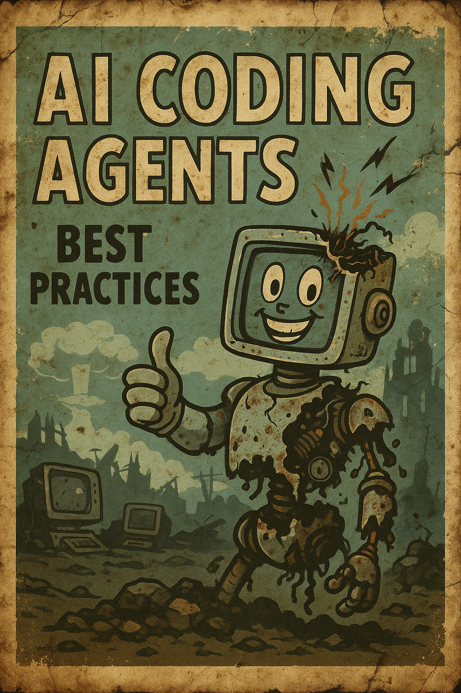

# AI Coding Agents: Tips, Tricks, and Best Practices

  

A lightweight, community-driven repo focused on practical guidance for AI coding agents. Short, high-signal writeups and examples. No bloat.

- Purpose: share what actually works when shipping agentic coding workflows
- Scope: prompts, tool routing, safety, evals, ops, and product tips
- Contributions: PRs welcome—add tips, mistakes to avoid, or small, runnable examples

## Articles
- Boss-on-Top: one decision-maker, many specialists → [articles/boss-on-top.md](articles/boss-on-top.md)
- Finish notifications on macOS → [articles/finish-notifications.md](articles/finish-notifications.md)

## Contributing
- Keep it concise and actionable
- Prefer small examples over long essays
- Link to proofs, repos, or demos when possible

MIT License. © 2025 Erick.
